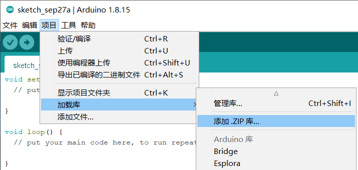

# 使用Arduino & 蓝牙接入  
所有开发板都可以通过连接蓝牙BLE模块接入到blinker，这里以Arduino开发板为例  

## 准备工作  
### 硬件准备  
Arduino + ble蓝牙串口模块  
推荐以下蓝牙ble模块：  
openjumper ble串口模块 （默认波特率9600）  
HM10 / HM11 （默认波特率9600）  
JDY08 / JDY10 （默认波特率115200）  
JDY18/JDY09 （默认波特率9600）  
以上均为蓝牙BLE模块  
[点击查看blinker设备端支持](https://diandeng.tech/doc/device-support)  

**特别提醒：**蓝牙2.0是已淘汰的技术，新手机已经不支持蓝牙2.0，blinker也不支持  

**将串口BLE模块的 TXD连接到UNO的2号引脚，RXD连接到UNO的3号引脚**  

### 软件准备  
**下载并安装Arduino IDE**  
[点击去下载](https://arduino.me/download)  
[Arduino IDE](https://arduino.me/download) 1.8.7或更新版本  
#### 下载并安装blinker APP  
**Android下载：**  
[点击下载](https://github.com/blinker-iot/app-release/releases) 或 在android应用商店搜索“blinker”下载安装  
**IOS下载：**  
[点击下载](https://itunes.apple.com/cn/app/id1357907814) 或 在app store中搜索“blinker”下载  

#### 下载并安装blinker Arduino库  
1. [点击下载](https://diandeng.tech/dev)  
2. 通过Arduino IDE **菜单>项目>加载库>添加.ZIP库** 导入到库，如图：  


## 在app中添加设备  
1. 确保蓝牙模块已通电  
2. 进入App，点击右上角的“+”号，然后选择 **添加设备**  
3. 点击选择**Arduino** > **蓝牙接入**  
4. 等待搜索设备  
5. 点击选择要接入的设备  
  
## 编译并上传示例程序 
打开Arduino IDE，通过 **文件>示例>Blinker>Blinker_Hello/Hello_BLE** 打开例程  
编译并上传程序到Arduino中  

**注意** 如果您使用的蓝牙模块波特率不是9600（JDY08、JDY10默认波特率115200），或者您不想使用2、3引脚接蓝牙模块，可以使用如下语句初始化蓝牙模块：  
```cpp
// 在Arduino UNO上使用软串口通信
Blinker.begin(); // 默认设置: 数字IO 2(RX) 3(TX), 波特率 9600 bps  
Blinker.begin(4, 5); // 设置数字IO 4(RX) 5(TX), 默认波特率 9600 bps  
Blinker.begin(4, 5, 115200); // 设置数字IO 4(RX) 5(TX) 及波特率 115200 bps  

// 在Arduino Mega/Due上使用硬串口通信
Blinker.begin(15, 14, 9600);   //使用Serial3  
Blinker.begin(17, 16, 115200); //使用Serial2  
Blinker.begin(19, 20, 115200); //使用Serial1  
```
**例程中宏LED_BUILTIN为开发板厂家定义的连接板载LED的引脚，如果您选择的开发板没有定义LED_BUILTIN，可以自行修改为您要使用的引脚**  

## 恭喜！一切就绪  
在APP中点击刚才您添加的设备，即可进入控制界面，点点按钮就可以控制Arduino上的LED灯开关  
另一个按钮也点下试试，放心，您的手机不会爆炸~  

## 进一步使用blinker
#### 想了解各接入方式的区别？  
看看[添加设备](?file=002-开发入门/001-添加设备 "添加设备")  
#### 想深入理解以上例程？  
看看[Arduino开发入门](?file=002-开发入门/002-Arduino开发入门 "Arduino开发入门")  
#### 更多实例？
看看[Arduino实例教程](https://arduino.me/s/blinker-arduino)  
#### 想制作与众不同的物联网设备？  
看看[自定义界面](?file=005-App使用/02-自定义布局 "自定义布局") 和 [Arduino 支持库](https://diandeng.tech/doc/arduino-support "Arduino支持")  

## 完整示例程序
```cpp
#define BLINKER_PRINT Serial
#define BLINKER_BLE

#include <Blinker.h>

// 新建组件对象
BlinkerButton Button1("btn-abc");
BlinkerNumber Number1("num-abc");

int counter = 0;

// 按下按键即会执行该函数
void button1_callback(const String & state) {
    BLINKER_LOG("get button state: ", state);
    digitalWrite(LED_BUILTIN, !digitalRead(LED_BUILTIN));
}

// 如果未绑定的组件被触发，则会执行其中内容
void dataRead(const String & data)
{
    BLINKER_LOG("Blinker readString: ", data);
    counter++;
    Number1.print(counter);
}

void setup() {
    // 初始化串口
    Serial.begin(115200);

    #if defined(BLINKER_PRINT)
        BLINKER_DEBUG.stream(BLINKER_PRINT);
    #endif
    
    // 初始化有LED的IO
    pinMode(LED_BUILTIN, OUTPUT);
    digitalWrite(LED_BUILTIN, HIGH);
    // 初始化blinker
    Blinker.begin();
    Blinker.attachData(dataRead);
    Button1.attach(button1_callback);
}

void loop() {
    Blinker.run();
}
```

## 为什么没有搜索到设备？  
0. android系统要求搜索蓝牙必须开启手机定位服务，个别系统（如华为）不会提示用户打开定位服务  
解决办法：开启手机定位服务  

1. 使用了蓝牙2.0设备或者其他blinker不支持的蓝牙设备  
解决办法：[点击查看blinker设备端支持](https://diandeng.tech/doc/device-support)  

## 其他注释事项  
使用Arduino MEGA时，仅以下IO可以设置为软串口RX: 10, 11, 12, 13, 50, 51, 52, 53, 62, 63, 64, 65, 66, 67, 68, 69  
使用Arduino Leonardo时，仅以下IO可以设置为软串口RX: 8, 9, 10, 11, 14, 15, 16  

